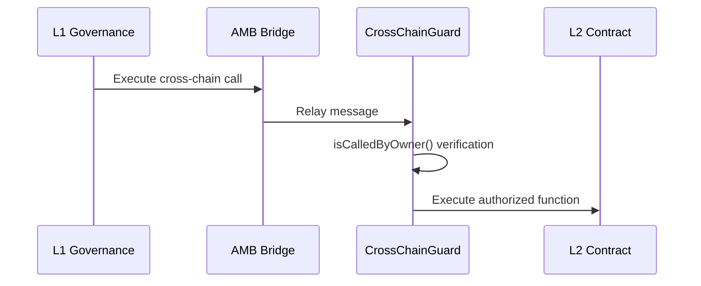

## Overview

The `CrossChainGuard` contract provides a security pattern for cross-chain authorization. It allows contracts on L2 (Gnosis Chain) to verify that function calls originate from an authorized owner on L1 (Ethereum mainnet) via the Arbitrary Message Bridge (AMB).

This enables secure cross-chain governance where mainnet contracts or multisigs can control L2 deployments without deploying private keys on L2.

**Contract Location**: `contracts/bridge/CrossChainGuard.sol:9`

## Use Case

Tornado Nova deploys the core TornadoPool contract on Gnosis Chain (L2) for lower transaction costs, but governance remains on Ethereum mainnet (L1). The CrossChainGuard allows L1 governance to:

- Update pool parameters
- Change fee structures
- Upgrade proxy implementations
- Execute emergency functions

All without requiring the governance private key on L2.

## Architecture



## State Variables

All state variables are immutable and set at deployment:

<ParamField path="ambBridge" type="IAMB">
  Address of the AMB bridge contract on the current chain. For Gnosis Chain: `0x75Df5AF045d91108662D8080fD1FEFAd6aA0bb59`
</ParamField>

<ParamField path="ownerChainId" type="bytes32">
  Chain ID where the owner resides. For Ethereum mainnet: `bytes32(uint256(1))`
</ParamField>

<ParamField path="owner" type="address">
  Address authorized to control this contract from the owner chain. Typically a governance multisig or DAO contract
</ParamField>

## Constructor

```solidity
constructor(
  address _ambBridge,
  uint256 _ownerChainId,
  address _owner
)
```

### Parameters

<ParamField path="_ambBridge" type="address">
  AMB bridge contract address on the deployment chain
</ParamField>

<ParamField path="_ownerChainId" type="uint256">
  Chain ID of the chain where the owner resides (e.g., 1 for Ethereum mainnet)
</ParamField>

<ParamField path="_owner" type="address">
  Address that will be authorized to call protected functions
</ParamField>

### Implementation

```solidity
constructor(
  address _ambBridge,
  uint256 _ownerChainId,
  address _owner
) {
  ambBridge = IAMB(_ambBridge);
  owner = _owner;
  ownerChainId = bytes32(uint256(_ownerChainId));
}
```

### Deployment Example

```solidity
// Deploy on Gnosis Chain (chainId 100)
CrossChainGuard guard = new CrossChainGuard(
  0x75Df5AF045d91108662D8080fD1FEFAd6aA0bb59, // AMB on Gnosis Chain
  1,                                          // Ethereum mainnet chainId
  0x123...abc                                 // L1 governance multisig
);
```

## Core Function

### isCalledByOwner

Verifies that the current call originates from the authorized owner on the correct chain via the AMB bridge.

```solidity
function isCalledByOwner() public virtual returns (bool)
```

**Returns**: `true` if all three verification checks pass, `false` otherwise

### Implementation

```solidity
function isCalledByOwner() public virtual returns (bool) {
  return
    msg.sender == address(ambBridge) && 
    ambBridge.messageSourceChainId() == ownerChainId && 
    ambBridge.messageSender() == owner;
}
```

### Triple Verification

The function performs three critical checks:

<Steps>
  <Step title="Check Direct Caller">
    Verifies `msg.sender == address(ambBridge)` - ensures only the AMB bridge can call this function
  </Step>
  
  <Step title="Check Source Chain">
    Verifies `ambBridge.messageSourceChainId() == ownerChainId` - ensures the message originated from the correct chain (e.g., Ethereum mainnet)
  </Step>
  
  <Step title="Check Original Sender">
    Verifies `ambBridge.messageSender() == owner` - ensures the original caller on the source chain is the authorized owner
  </Step>
</Steps>

<Note>
  **All three checks must pass** for authorization to succeed. This prevents:
  - Direct calls from unauthorized addresses
  - Cross-chain calls from wrong chains
  - Cross-chain calls from unauthorized addresses on the correct chain
</Note>

## Usage Pattern

Contracts that need cross-chain authorization inherit from `CrossChainGuard` and use the `isCalledByOwner()` check:

### Basic Implementation

```solidity
contract GovernedPool is CrossChainGuard {
  constructor(
    address _ambBridge,
    uint256 _ownerChainId,
    address _owner
  ) CrossChainGuard(_ambBridge, _ownerChainId, _owner) {}

  function updateFee(uint256 newFee) external {
    require(isCalledByOwner(), "Only owner");
    fee = newFee;
  }
}
```

### Modifier Pattern

Many contracts create a modifier for cleaner syntax:

```solidity
contract GovernedPool is CrossChainGuard {
  modifier onlyOwner() {
    require(isCalledByOwner(), "Only owner");
    _;
  }

  function updateFee(uint256 newFee) external onlyOwner {
    fee = newFee;
  }
}
```

## Cross-Chain Execution Flow

How governance executes a function from L1 to L2:

### Step 1: Encode Function Call

On L1, encode the target function call:

```solidity
// L1: Prepare the call to L2
bytes memory data = abi.encodeWithSignature(
  "updateFee(uint256)",
  0.01 ether
);
```

### Step 2: Send via AMB

```solidity
// L1: Send message through AMB
address l2Target = 0x...; // GovernedPool on L2
uint256 gasLimit = 1000000;

ambBridge.requireToPassMessage(
  l2Target,
  data,
  gasLimit
);
```

### Step 3: AMB Relays Message

The AMB validators:
1. Observe the message on L1
2. Reach consensus
3. Execute the message on L2 by calling the target contract

### Step 4: Verification on L2

When the L2 contract receives the call:

```solidity
function updateFee(uint256 newFee) external onlyOwner {
  // isCalledByOwner() returns true because:
  // 1. msg.sender = AMB bridge ✓
  // 2. messageSourceChainId = 1 (mainnet) ✓
  // 3. messageSender = governance address ✓
  
  fee = newFee;
}
```

## AMB Bridge Interface

The contract interacts with the AMB bridge through the `IAMB` interface:

```solidity
interface IAMB {
  function messageSender() external view returns (address);
  function messageSourceChainId() external view returns (bytes32);
}
```

<ParamField path="messageSender()" type="function">
  Returns the address that initiated the cross-chain message on the source chain
</ParamField>

<ParamField path="messageSourceChainId()" type="function">
  Returns the chain ID where the message originated
</ParamField>

<Note>
  These functions only return meaningful values during cross-chain message execution. Outside of that context, they may return zero or revert.
</Note>

## Security Considerations

### Immutable Configuration

All configuration is immutable to prevent governance takeover:

```solidity
IAMB public immutable ambBridge;
bytes32 public immutable ownerChainId;
address public immutable owner;
```

- Cannot change the AMB bridge address after deployment
- Cannot change which chain the owner resides on
- Cannot change the owner address

<Note>
  **Design Decision**: Immutability prevents malicious governance from changing the authorization mechanism. If ownership needs to transfer, deploy a new contract.
</Note>

### Virtual Function

The `isCalledByOwner()` function is marked `virtual`, allowing inheriting contracts to:

- Add additional authorization logic
- Implement time-locks
- Add multi-signature requirements
- Create temporary permission grants

```solidity
contract TimelockGuard is CrossChainGuard {
  mapping(bytes32 => uint256) public timelocks;

  function isCalledByOwner() public override returns (bool) {
    if (!super.isCalledByOwner()) return false;
    
    bytes32 callHash = keccak256(msg.data);
    require(block.timestamp >= timelocks[callHash], "Timelock");
    
    return true;
  }
}
```

### AMB Bridge Trust

The system relies on the security of the AMB bridge:

- **Bridge Validators**: Small set of validators must be honest
- **Bridge Upgrades**: Bridge governance could change behavior
- **Message Replay**: AMB prevents replay, but verify in application logic if needed

<Note>
  **Trust Assumption**: Users trust that AMB validators will not collude to forge messages or halt the bridge.
</Note>

## Common Patterns

### Pattern 1: Single Owner Function

```solidity
function emergencyShutdown() external {
  require(isCalledByOwner(), "Unauthorized");
  paused = true;
}
```

### Pattern 2: Owner or Local Admin

```solidity
address public localAdmin;

function updateParameter(uint256 value) external {
  require(
    isCalledByOwner() || msg.sender == localAdmin,
    "Unauthorized"
  );
  parameter = value;
}
```

### Pattern 3: Tiered Permissions

```solidity
function criticalFunction() external {
  require(isCalledByOwner(), "Only L1 governance");
  // Critical operation
}

function regularFunction() external {
  require(msg.sender == localAdmin, "Only local admin");
  // Regular operation
}
```

## Chain IDs

Common chain IDs for cross-chain governance:

| Chain | Chain ID | Hex |
|-------|----------|-----|
| Ethereum Mainnet | 1 | 0x01 |
| Gnosis Chain | 100 | 0x64 |
| Polygon | 137 | 0x89 |
| Arbitrum One | 42161 | 0xa4b1 |
| Optimism | 10 | 0x0a |

## Complete Source Code

```solidity
// SPDX-License-Identifier: MIT
pragma solidity ^0.7.0;

import { IAMB } from "../interfaces/IBridge.sol";

/** @dev Special cross chain guard that can authorize caller as owner of this contract 
 *  according to XDAI AMB bridge protocol.
 * more info: https://docs.tokenbridge.net/amb-bridge/development-of-a-cross-chain-application/how-to-develop-xchain-apps-by-amb#receive-a-method-call-from-the-amb-bridge
 */
contract CrossChainGuard {
  IAMB public immutable ambBridge;
  bytes32 public immutable ownerChainId;
  address public immutable owner;

  constructor(
    address _ambBridge,
    uint256 _ownerChainId,
    address _owner
  ) {
    ambBridge = IAMB(_ambBridge);
    owner = _owner;
    ownerChainId = bytes32(uint256(_ownerChainId));
  }

  function isCalledByOwner() public virtual returns (bool) {
    return
      msg.sender == address(ambBridge) && 
      ambBridge.messageSourceChainId() == ownerChainId && 
      ambBridge.messageSender() == owner;
  }
}
```

## Integration Example

Complete example of L1→L2 governance:

```solidity
// L1: Governance contract on Ethereum mainnet
contract L1Governance {
  IAMB public ambBridge = IAMB(0x4C36d2919e407f0Cc2Ee3c993ccF8ac26d9CE64e);
  
  function executeL2Governance(
    address l2Target,
    bytes calldata data
  ) external onlyMultisig {
    ambBridge.requireToPassMessage(
      l2Target,
      data,
      1000000 // gas limit
    );
  }
}

// L2: Governed contract on Gnosis Chain
contract L2Pool is CrossChainGuard {
  uint256 public fee;
  
  constructor(
    address _ambBridge,
    uint256 _ownerChainId,
    address _l1Governance
  ) CrossChainGuard(_ambBridge, _ownerChainId, _l1Governance) {}
  
  function setFee(uint256 _fee) external {
    require(isCalledByOwner(), "Only L1 governance");
    fee = _fee;
  }
}

// Usage from L1:
// l1Governance.executeL2Governance(
//   l2PoolAddress,
//   abi.encodeWithSignature("setFee(uint256)", 0.01 ether)
// );
```

## External Resources

- [AMB Bridge Documentation](https://docs.tokenbridge.net/amb-bridge/about-amb-bridge)
- [Cross-Chain Development Guide](https://docs.tokenbridge.net/amb-bridge/development-of-a-cross-chain-application)
- [Gnosis Chain AMB](https://docs.gnosischain.com/bridges/Token%20Bridge/amb-bridge)

## Related Documentation

- [Bridge System Overview](/bridge/overview)
- [L1Unwrapper Contract](/bridge/l1-unwrapper)
