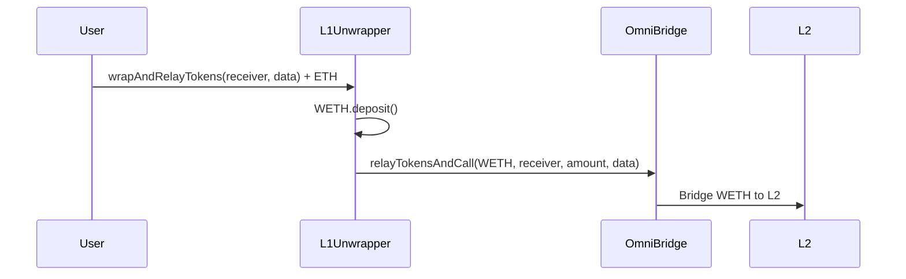
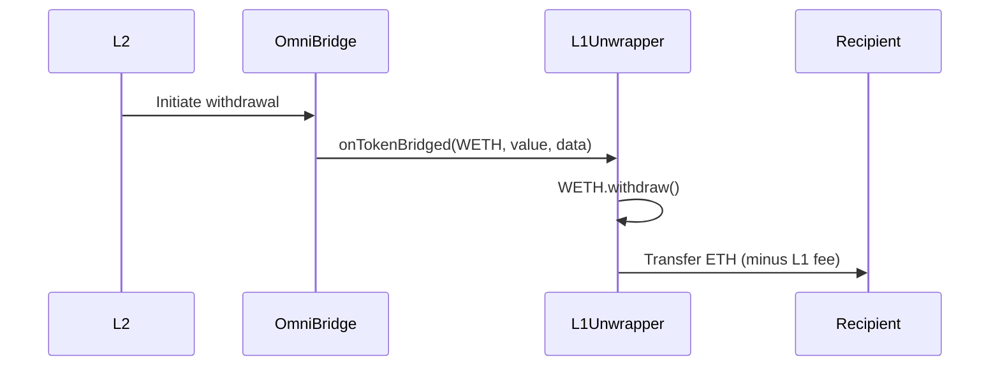

## Introduction

Tornado Nova implements a cross-chain bridge system that enables seamless interaction between Ethereum mainnet (L1) and Gnosis Chain (formerly xDai, L2). The bridge infrastructure consists of two main components:

- **L1Unwrapper**: Handles ETH↔WETH bridging and account registration on mainnet
- **CrossChainGuard**: Enables cross-chain governance via the Arbitrary Message Bridge (AMB)

## Architecture

The bridge system leverages two distinct bridge protocols:

<Steps>
  <Step title="OmniBridge for Asset Transfers">
    The OmniBridge protocol facilitates ERC20 token transfers between chains. L1Unwrapper extends `WETHOmnibridgeRouter` to handle ETH/WETH conversions automatically.
  </Step>
  
  <Step title="AMB for Governance Messages">
    The Arbitrary Message Bridge (AMB) enables cross-chain contract calls, allowing mainnet governance to control L2 contracts via CrossChainGuard.
  </Step>
</Steps>

## ETH↔WETH Bridging Flow

### L1 → L2 (Mainnet to Gnosis Chain)



### L2 → L1 (Gnosis Chain to Mainnet)



## Key Features

### Automatic ETH/WETH Conversion

Users don't need to manually wrap ETH. The L1Unwrapper handles:
- **Deposits**: Wraps ETH to WETH before bridging
- **Withdrawals**: Unwraps WETH to ETH after bridging

### Account Registration

The bridge system includes TornadoPool account registration, allowing users to register their public keys during the bridging process.

```solidity
struct Account {
  address owner;
  bytes publicKey;
}
```

### L1 Fee Mechanism

Withdrawals to L1 include a configurable fee to cover gas costs:
- Fee can be sent to a designated `l1FeeReceiver` contract
- If no receiver is set, fee goes to `tx.origin` (the relayer)
- Enables subsidized transactions and fee sharing logic

### Cross-Chain Governance

The CrossChainGuard pattern enables secure cross-chain administration:

<Note>
  The guard verifies that calls originate from the correct chain and authorized owner address through the AMB bridge, preventing unauthorized cross-chain access.
</Note>

## Bridge Protocols

### OmniBridge

**Purpose**: ERC20 token transfers between chains

**Documentation**: [TokenBridge OmniBridge Docs](https://docs.tokenbridge.net/eth-xdai-amb-bridge/about-the-eth-xdai-amb)

**Key Interface**:
```solidity
interface IOmnibridge {
  function relayTokensAndCall(
    address token,
    address receiver,
    uint256 value,
    bytes calldata data
  ) external;
}
```

### Arbitrary Message Bridge (AMB)

**Purpose**: Cross-chain contract calls and governance

**Documentation**: [AMB Development Guide](https://docs.tokenbridge.net/amb-bridge/development-of-a-cross-chain-application)

**Key Interface**:
```solidity
interface IAMB {
  function messageSender() external view returns (address);
  function messageSourceChainId() external view returns (bytes32);
}
```

## Security Considerations

<Note>
  **Bridge Trust Assumptions**
  
  The bridge system relies on the security of both OmniBridge and AMB protocols. Users should be aware that:
  - Bridge validators control asset transfers
  - Cross-chain messages are subject to bridge confirmation times
  - Bridge upgrades or governance changes could affect functionality
</Note>

### L1Unwrapper Security

- Only accepts WETH tokens to prevent malicious token bridging
- Validates `msg.sender` is the bridge contract in `onTokenBridged()`
- Enforces correct data length (64 bytes) for recipient and fee data
- Uses `SafeMath` for all arithmetic operations

### CrossChainGuard Security

- Immutable configuration (bridge, chainId, owner) set at deployment
- Triple verification in `isCalledByOwner()`:
  1. Caller must be the AMB bridge contract
  2. Message must originate from the correct chain
  3. Message sender must be the authorized owner

## Related Contracts

- [L1Unwrapper](/bridge/l1-unwrapper) - ETH/WETH bridging and registration
- [CrossChainGuard](/bridge/cross-chain-guard) - Cross-chain governance authorization

## External Resources

- [TokenBridge Documentation](https://docs.tokenbridge.net/)
- [Gnosis Chain Bridge UI](https://bridge.gnosischain.com/)
- [OmniBridge GitHub](https://github.com/omni/omnibridge)
