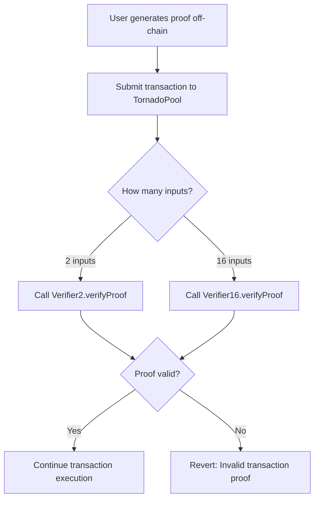

## Overview

Tornado Nova uses zkSNARK (Zero-Knowledge Succinct Non-Interactive Argument of Knowledge) verifiers to validate transaction proofs. The protocol implements two verifier contracts:

- **Verifier2** - Verifies proofs for transactions with 2 inputs
- **Verifier16** - Verifies proofs for transactions with 16 inputs

<Note>
These verifiers enable privacy by allowing users to prove they own valid inputs without revealing which specific commitments they're spending.
</Note>

## IVerifier Interface

Both verifier contracts implement the `IVerifier` interface:

```solidity
interface IVerifier {
    function verifyProof(bytes memory _proof, uint256[7] memory _input) external view returns (bool);
    function verifyProof(bytes memory _proof, uint256[21] memory _input) external view returns (bool);
}
```

The interface uses function overloading to support different input sizes:
- `uint256[7]` - For 2-input transactions (Verifier2)
- `uint256[21]` - For 16-input transactions (Verifier16)

## Verifier2 Contract

### Purpose

Verifier2 handles the most common transaction type with 2 input nullifiers. This is optimized for:
- Standard deposits
- Simple transfers
- Small withdrawals
- Gas-efficient operations

### Proof Structure

The proof verification requires 7 public inputs:

```solidity
function verifyProof(bytes memory _proof, uint256[7] memory _input) external view returns (bool)
```

<ParamField path="_input[0]" type="uint256">
  **Merkle Root** - The root of the commitment tree, proving inputs exist in the tree
</ParamField>

<ParamField path="_input[1]" type="uint256">
  **Public Amount** - The amount being deposited or withdrawn, calculated from extAmount and fee
</ParamField>

<ParamField path="_input[2]" type="uint256">
  **External Data Hash** - Hash of the ExtData structure, binding transaction metadata to the proof
</ParamField>

<ParamField path="_input[3]" type="uint256">
  **Input Nullifier 1** - First nullifier, proving ownership of first input
</ParamField>

<ParamField path="_input[4]" type="uint256">
  **Input Nullifier 2** - Second nullifier, proving ownership of second input
</ParamField>

<ParamField path="_input[5]" type="uint256">
  **Output Commitment 1** - First output commitment to be added to the tree
</ParamField>

<ParamField path="_input[6]" type="uint256">
  **Output Commitment 2** - Second output commitment to be added to the tree
</ParamField>

### Usage in TornadoPool

The TornadoPool contract calls Verifier2 when the proof has 2 input nullifiers:

```solidity
if (_args.inputNullifiers.length == 2) {
    return verifier2.verifyProof(
        _args.proof,
        [
            uint256(_args.root),
            _args.publicAmount,
            uint256(_args.extDataHash),
            uint256(_args.inputNullifiers[0]),
            uint256(_args.inputNullifiers[1]),
            uint256(_args.outputCommitments[0]),
            uint256(_args.outputCommitments[1])
        ]
    );
}
```

### Gas Efficiency

<Note>
Verifier2 is the most gas-efficient verifier, typically using ~250,000-300,000 gas per verification.
</Note>

## Verifier16 Contract

### Purpose

Verifier16 handles transactions with up to 16 input nullifiers, enabling:
- Consolidation of many small notes
- Large withdrawals from multiple deposits
- Batch operations
- UTXO management

### Proof Structure

The proof verification requires 21 public inputs:

```solidity
function verifyProof(bytes memory _proof, uint256[21] memory _input) external view returns (bool)
```

**Input Array Structure:**

```solidity
[
    uint256(_args.root),                      // [0] Merkle root
    _args.publicAmount,                       // [1] Public amount
    uint256(_args.extDataHash),               // [2] External data hash
    uint256(_args.inputNullifiers[0]),        // [3] Nullifier 1
    uint256(_args.inputNullifiers[1]),        // [4] Nullifier 2
    uint256(_args.inputNullifiers[2]),        // [5] Nullifier 3
    uint256(_args.inputNullifiers[3]),        // [6] Nullifier 4
    uint256(_args.inputNullifiers[4]),        // [7] Nullifier 5
    uint256(_args.inputNullifiers[5]),        // [8] Nullifier 6
    uint256(_args.inputNullifiers[6]),        // [9] Nullifier 7
    uint256(_args.inputNullifiers[7]),        // [10] Nullifier 8
    uint256(_args.inputNullifiers[8]),        // [11] Nullifier 9
    uint256(_args.inputNullifiers[9]),        // [12] Nullifier 10
    uint256(_args.inputNullifiers[10]),       // [13] Nullifier 11
    uint256(_args.inputNullifiers[11]),       // [14] Nullifier 12
    uint256(_args.inputNullifiers[12]),       // [15] Nullifier 13
    uint256(_args.inputNullifiers[13]),       // [16] Nullifier 14
    uint256(_args.inputNullifiers[14]),       // [17] Nullifier 15
    uint256(_args.inputNullifiers[15]),       // [18] Nullifier 16
    uint256(_args.outputCommitments[0]),      // [19] Output commitment 1
    uint256(_args.outputCommitments[1])       // [20] Output commitment 2
]
```

### Usage in TornadoPool

```solidity
else if (_args.inputNullifiers.length == 16) {
    return verifier16.verifyProof(_args.proof, [...]);
} else {
    revert("unsupported input count");
}
```

### Gas Considerations

<Warning>
Verifier16 is significantly more expensive than Verifier2, typically using ~800,000-1,000,000 gas per verification. Use only when necessary for consolidating multiple inputs.
</Warning>

## Proof Generation

While the verifier contracts are on-chain, proof generation happens off-chain using the Circom circuits:

1. **Circuit Definition** - Defines the constraints that must be satisfied
2. **Witness Generation** - Computes private and public inputs
3. **Proof Generation** - Creates the zkSNARK proof using a proving key
4. **On-Chain Verification** - Verifier contract checks the proof

### What the Proof Demonstrates

The zero-knowledge proofs prove the following without revealing private data:

- **Input Ownership**: The prover knows the private keys for the input commitments
- **Merkle Membership**: The inputs exist in the commitment tree
- **Nullifier Correctness**: Nullifiers are correctly derived from inputs
- **Output Validity**: Output commitments are properly constructed
- **Amount Consistency**: Input amounts equal output amounts plus public amount

## Security Properties

### Soundness

<Note>
A malicious prover cannot create a valid proof for an invalid statement. The cryptographic security is based on the hardness of the discrete logarithm problem over elliptic curves.
</Note>

### Zero-Knowledge

The proof reveals nothing about:
- Which commitments are being spent
- The amounts of individual inputs/outputs
- The relationship between transactions
- The sender's identity

### Completeness

Any valid proof will be accepted by the verifier:

```solidity
require(verifyProof(_args), "Invalid transaction proof");
```

If this check passes, the transaction proceeds with confidence that all constraints are satisfied.

## Elliptic Curve: BN254

Both verifiers use the BN254 (also called alt-bn128) elliptic curve, which:

- Is supported natively by Ethereum's precompiled contracts
- Provides ~128-bit security level
- Has a scalar field size of:
  ```
  FIELD_SIZE = 21888242871839275222246405745257275088548364400416034343698204186575808495617
  ```

<Warning>
All public inputs must be less than `FIELD_SIZE`. The TornadoPool contract enforces this for critical values.
</Warning>

## Verification Process Flow



## Example: Verifying a 2-Input Transaction

```solidity
// Prepare proof inputs
uint256[7] memory inputs = [
    uint256(merkleRoot),
    publicAmount,
    uint256(extDataHash),
    uint256(nullifier1),
    uint256(nullifier2),
    uint256(outputCommitment1),
    uint256(outputCommitment2)
];

// Verify the proof
bool isValid = verifier2.verifyProof(proofBytes, inputs);

if (!isValid) {
    revert("Invalid proof");
}

// Proof is valid, proceed with transaction
```

## Trusted Setup

<Warning>
zkSNARK verifiers rely on a trusted setup ceremony. The security of the system depends on at least one participant in the ceremony honestly deleting their toxic waste.
</Warning>

The verifier contracts are generated from:
1. **Circuit compilation** - Circom circuits → R1CS constraints
2. **Powers of Tau ceremony** - Generates common reference string
3. **Circuit-specific setup** - Generates proving and verification keys
4. **Verifier generation** - Creates Solidity verifier contract

## Upgrading Verifiers

<Note>
The verifier addresses are set as `immutable` in the TornadoPool constructor and cannot be changed after deployment. Any verifier upgrades would require deploying a new TornadoPool contract.
</Note>

```solidity
IVerifier public immutable verifier2;
IVerifier public immutable verifier16;
```

This design choice prioritizes security and immutability over upgradeability.

## Performance Comparison

| Verifier | Inputs | Gas Cost | Use Case |
|----------|--------|----------|----------|
| Verifier2 | 2 | ~250-300k | Standard transactions |
| Verifier16 | 16 | ~800k-1M | Note consolidation |

## Integration with TornadoPool

The verifiers are tightly integrated into TornadoPool's transaction validation:

```solidity
function _transact(Proof memory _args, ExtData memory _extData) internal {
    require(isKnownRoot(_args.root), "Invalid merkle root");
    
    for (uint256 i = 0; i < _args.inputNullifiers.length; i++) {
        require(!isSpent(_args.inputNullifiers[i]), "Input is already spent");
    }
    
    require(uint256(_args.extDataHash) == uint256(keccak256(abi.encode(_extData))) % FIELD_SIZE, 
            "Incorrect external data hash");
    
    require(_args.publicAmount == calculatePublicAmount(_extData.extAmount, _extData.fee), 
            "Invalid public amount");
    
    // Critical verification step
    require(verifyProof(_args), "Invalid transaction proof");
    
    // If we reach here, the proof is valid and transaction can proceed
    // ...
}
```