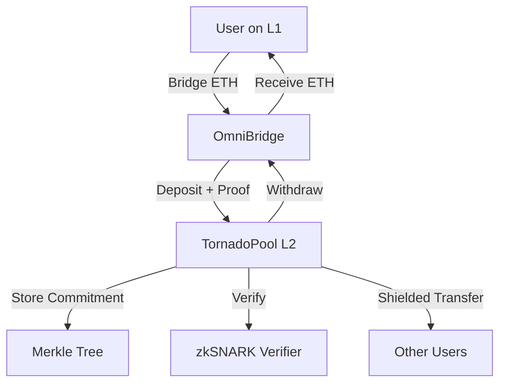

# Introduction to Tornado Nova

Tornado Nova is an experimental privacy pool protocol that represents a significant evolution beyond the original Tornado Cash. Unlike fixed-denomination mixers, Nova allows you to **deposit arbitrary amounts** and perform **internal shielded transfers** between users—all while maintaining strong privacy guarantees through zero-knowledge proofs.

<CardGroup cols={2}>
  <Card title="How it works" icon="shield-halved" href="/how-it-works">
    Learn about the UTXO model, zkSNARKs, and privacy mechanisms
  </Card>
  <Card title="Installation" icon="rocket" href="/developer/installation">
    Get up and running with Tornado Nova in minutes
  </Card>
  <Card title="API reference" icon="code" href="/api/tornado-pool-api">
    Explore the complete API documentation
  </Card>
  <Card title="Smart contracts" icon="file-contract" href="/contracts/tornado-pool">
    Deep dive into the Solidity implementation
  </Card>
</CardGroup>

## Key features

### Arbitrary deposit amounts

Unlike traditional Tornado Cash pools with fixed denominations (0.1, 1, 10, 100 ETH), Nova accepts any amount within configured limits:

```solidity
function transact(Proof memory _args, ExtData memory _extData) public {
  if (_extData.extAmount > 0) {
    // for deposits from L2
    token.transferFrom(msg.sender, address(this), uint256(_extData.extAmount));
    require(uint256(_extData.extAmount) <= maximumDepositAmount, 
      "amount is larger than maximumDepositAmount");
  }
  _transact(_args, _extData);
}
```

<Note>
The beta version has a 1 ETH deposit limit that can be increased through governance.
</Note>

### Internal shielded transfers

Users can transfer funds to each other inside the pool without withdrawing to Layer 1. This enables:

- Private peer-to-peer payments
- Fund pooling and splitting
- Multi-hop privacy routing
- Gas-efficient privacy operations on L2

```javascript
// Example: Shielded transfer between two users
const senderUtxo = new Utxo({ amount: ethers.utils.parseEther('0.5'), keypair: senderKeypair })
const recipientUtxo = new Utxo({ amount: ethers.utils.parseEther('0.5'), keypair: recipientKeypair })

await transaction({
  tornadoPool,
  inputs: [senderUtxo],
  outputs: [recipientUtxo]
})
```

### UTXO-based privacy model

Tornado Nova uses a UTXO (Unspent Transaction Output) model similar to Bitcoin, where each transaction:

1. **Consumes** up to 16 input UTXOs (spent commitments)
2. **Creates** exactly 2 output UTXOs (new commitments)
3. **Proves** correctness using zkSNARKs without revealing amounts or relationships

```javascript
class Utxo {
  constructor({ amount = 0, keypair = new Keypair(), blinding = randomBN(), index = null } = {}) {
    this.amount = BigNumber.from(amount)
    this.blinding = BigNumber.from(blinding)
    this.keypair = keypair
    this.index = index
  }

  getCommitment() {
    return poseidonHash([this.amount, this.keypair.pubkey, this.blinding])
  }

  getNullifier() {
    const signature = this.keypair.sign(this.getCommitment(), this.index || 0)
    return poseidonHash([this.getCommitment(), this.index || 0, signature])
  }
}
```

### Zero-knowledge proof verification

Every transaction requires a zkSNARK proof that verifies:

- Input UTXOs exist in the commitment tree
- User knows the private keys for all inputs
- Output commitments are correctly formed
- Amounts balance (inputs = outputs + fees)

```solidity
function verifyProof(Proof memory _args) public view returns (bool) {
  if (_args.inputNullifiers.length == 2) {
    return verifier2.verifyProof(
      _args.proof,
      [
        uint256(_args.root),
        _args.publicAmount,
        uint256(_args.extDataHash),
        uint256(_args.inputNullifiers[0]),
        uint256(_args.inputNullifiers[1]),
        uint256(_args.outputCommitments[0]),
        uint256(_args.outputCommitments[1])
      ]
    );
  } else if (_args.inputNullifiers.length == 16) {
    // 16-input verifier for batch operations
    return verifier16.verifyProof(_args.proof, [...]);
  }
}
```

<Info>
Tornado Nova supports both 2-input and 16-input transactions for efficient UTXO consolidation.
</Info>

### Cross-chain L1↔L2 bridge integration

Built on xDai (now Gnosis Chain), Nova seamlessly bridges between Ethereum mainnet and L2:

- **L1 → L2 deposits**: Bridge ETH from mainnet, deposit into privacy pool
- **L2 → L1 withdrawals**: Withdraw from pool, bridge back to mainnet
- **Governance integration**: L1 governance controls L2 contract upgrades via cross-chain messages

```solidity
function onTokenBridged(
  IERC6777 _token,
  uint256 _amount,
  bytes calldata _data
) external override {
  (Proof memory _args, ExtData memory _extData) = abi.decode(_data, (Proof, ExtData));
  require(_token == token, "provided token is not supported");
  require(msg.sender == omniBridge, "only omni bridge");
  require(_amount >= uint256(_extData.extAmount), "amount from bridge is incorrect");
  
  // Process the deposit transaction
  try TornadoPool(address(this)).onTransact(_args, _extData) {} 
  catch (bytes memory) {
    token.transfer(multisig, sentAmount);
  }
}
```

<Warning>
L2 → L1 withdrawals must be at least 0.05 ETH to prevent bridge spam attacks.
</Warning>

## Architecture overview

Tornado Nova consists of three main components:

1. **TornadoPool contract**: Core privacy pool logic with UTXO management
2. **Verifier contracts**: zkSNARK verification for 2 and 16 input transactions
3. **Bridge integration**: OmniBridge for cross-chain ETH transfers



## Security considerations

<Note>
Tornado Nova was audited by Igor Gulamov from Zeropool. [View the audit report](https://github.com/tornadocash/tornado-pool/blob/master/resources/Zeropool-Tornado.pool-audit.pdf).
</Note>

Key security features:

- **Upgradeable via governance**: The L2 contract can be upgraded by Tornado Cash governance through cross-chain messages
- **Reentrancy protection**: All external calls use `ReentrancyGuard`
- **Nullifier tracking**: Prevents double-spending of UTXOs
- **Merkle root history**: Maintains 100 historical roots to support concurrent transactions

```solidity
function _transact(Proof memory _args, ExtData memory _extData) internal nonReentrant {
  require(isKnownRoot(_args.root), "Invalid merkle root");
  for (uint256 i = 0; i < _args.inputNullifiers.length; i++) {
    require(!isSpent(_args.inputNullifiers[i]), "Input is already spent");
  }
  require(verifyProof(_args), "Invalid transaction proof");
  
  // Mark nullifiers as spent
  for (uint256 i = 0; i < _args.inputNullifiers.length; i++) {
    nullifierHashes[_args.inputNullifiers[i]] = true;
  }
  
  // Insert new commitments and emit events
  _insert(_args.outputCommitments[0], _args.outputCommitments[1]);
}
```

## Next steps

<CardGroup cols={2}>
  <Card title="Understand the protocol" href="/how-it-works">
    Deep dive into how Tornado Nova achieves privacy
  </Card>
  <Card title="Start building" href="/developer/installation">
    Integrate Tornado Nova into your application
  </Card>
</CardGroup>