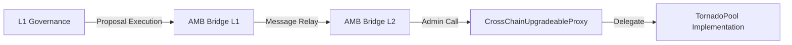

Tornado Nova uses a sophisticated cross-chain governance system that allows Layer 1 governance to control Layer 2 contracts via the Arbitrary Message Bridge (AMB) protocol.

## Governance Architecture

The governance system consists of three main components:

1. **L1 Governance Contract**: Tornado Cash governance on mainnet
2. **AMB Bridge**: Message relay between L1 and L2
3. **CrossChainUpgradeableProxy**: L2 proxy that validates cross-chain admin calls



## Cross-Chain Admin Verification

The `CrossChainGuard` contract verifies that calls originate from the authorized L1 governance:

```solidity contracts/bridge/CrossChainGuard.sol
function isCalledByOwner() public virtual returns (bool) {
  return
    msg.sender == address(ambBridge) &&
    ambBridge.messageSourceChainId() == ownerChainId &&
    ambBridge.messageSender() == owner;
}
```

Three conditions must be met:

1. **Direct caller** must be the AMB bridge contract
2. **Source chain ID** must match the expected L1 chain ID
3. **Message sender** must be the authorized governance address

<Note>
This three-part verification ensures that only authorized L1 governance can control L2 contracts, preventing unauthorized access even if someone controls the AMB bridge.
</Note>

## Governance Operations

### Contract Upgrades

Upgrade the TornadoPool implementation to a new version.

<Steps>
  <Step title="Deploy New Implementation">
    Deploy the upgraded TornadoPool implementation on L2:

    ```bash
    npx hardhat run scripts/deployTornadoUpgrade.js --network xdai
    ```

    This uses CREATE2 for deterministic addresses:

    ```javascript
    const { generate } = require('./src/0_generateAddresses')
    const contracts = await generate()
    const newImplementation = contracts.poolContract.address
    ```
  </Step>

  <Step title="Create Governance Proposal">
    Create a proposal on L1 governance to upgrade the L2 proxy:

    ```javascript
    const proposalData = {
      target: ambBridge.address,
      value: 0,
      signature: 'requireToPassMessage(address,bytes,uint256)',
      calldata: ethers.utils.defaultAbiCoder.encode(
        ['address', 'bytes', 'uint256'],
        [
          proxyAddress, // L2 proxy address
          upgradeCalldata, // upgradeTo(address) encoded
          gasLimit, // Gas limit for L2 execution
        ]
      ),
    }
    ```
  </Step>

  <Step title="Encode Upgrade Call">
    Encode the `upgradeTo()` function call:

    ```javascript
    const ProxyAdmin = await ethers.getContractFactory(
      'CrossChainUpgradeableProxy'
    )
    const upgradeCalldata = ProxyAdmin.interface.encodeFunctionData(
      'upgradeTo',
      [newImplementationAddress]
    )
    ```
  </Step>

  <Step title="Execute via Governance">
    Execute the proposal through L1 governance:

    - Vote on the proposal
    - Wait for voting period and timelock
    - Execute the proposal
    - AMB bridge relays the message to L2
    - L2 proxy verifies the cross-chain call and upgrades
  </Step>

  <Step title="Verify Upgrade">
    Confirm the upgrade on L2:

    ```javascript
    const proxy = await ethers.getContractAt(
      'CrossChainUpgradeableProxy',
      proxyAddress
    )
    const implementation = await proxy.implementation()
    console.log('Current implementation:', implementation)
    ```
  </Step>
</Steps>

<Warning>
**Upgrade Safety Checklist:**

- Test upgrade on testnet first
- Verify implementation contract is audited
- Check storage layout compatibility
- Ensure no breaking changes to external interfaces
- Have rollback plan ready
</Warning>

### Configure Deposit Limits

Update the maximum deposit amount via governance.

```javascript
// Encode the configureLimits call
const TornadoPool = await ethers.getContractFactory('TornadoPool')
const configureLimitsCalldata = TornadoPool.interface.encodeFunctionData(
  'configureLimits',
  [ethers.utils.parseEther('200')] // New max: 200 tokens
)

// Create governance proposal to call via AMB bridge
const proposalData = {
  target: ambBridge.address,
  value: 0,
  signature: 'requireToPassMessage(address,bytes,uint256)',
  calldata: ethers.utils.defaultAbiCoder.encode(
    ['address', 'bytes', 'uint256'],
    [
      proxyAddress, // L2 proxy address
      configureLimitsCalldata,
      500000, // Gas limit
    ]
  ),
}
```

See contracts/TornadoPool.sol:191-193 for the implementation.

<Note>
The `configureLimits()` function can only be called by the multisig on L2 or via cross-chain governance. Direct calls from other addresses will revert.
</Note>

### Emergency Operations

The L2 multisig can perform certain emergency operations without going through L1 governance:

#### Rescue Tokens

Recover accidentally sent tokens (except the pool token):

```solidity
function rescueTokens(
  IERC6777 _token,
  address payable _to,
  uint256 _balance
) external onlyMultisig
```

Example usage:

```javascript
const tornadoPool = await ethers.getContractAt('TornadoPool', proxyAddress)

// Rescue accidentally sent DAI
await tornadoPool.rescueTokens(
  '0x6B175474E89094C44Da98b954EedeAC495271d0F', // DAI address
  multisigAddress,
  0 // 0 = all balance
)
```

<Warning>
The `rescueTokens()` function cannot rescue the pool's main token (e.g., WETH) to prevent theft of user deposits. Attempts to rescue the pool token will revert.
</Warning>

#### Configure Limits (Multisig)

The L2 multisig can also call `configureLimits()` directly for faster response:

```javascript
const tornadoPool = await ethers.getContractAt('TornadoPool', proxyAddress)

// Connect as multisig signer
const multisig = tornadoPool.connect(multisigSigner)

// Update maximum deposit amount
await multisig.configureLimits(
  ethers.utils.parseEther('50') // New max: 50 tokens
)
```

See contracts/TornadoPool.sol:191-193.

## AMB Bridge Protocol

### Message Flow

<Steps>
  <Step title="L1: Initiate Message">
    L1 governance calls `requireToPassMessage()` on AMB bridge:

    ```solidity
    function requireToPassMessage(
      address _contract,
      bytes memory _data,
      uint256 _gas
    ) external returns (bytes32)
    ```

    Parameters:
    - `_contract`: Target contract on L2 (proxy address)
    - `_data`: Encoded function call
    - `_gas`: Gas limit for L2 execution
  </Step>

  <Step title="Bridge: Relay Message">
    AMB bridge validators observe the L1 transaction and relay it to L2:

    - Validators collect signatures
    - Once threshold is met, message is relayed
    - L2 AMB bridge executes the message
  </Step>

  <Step title="L2: Verify and Execute">
    L2 AMB bridge calls the target contract:

    ```javascript
    // msg.sender = AMB bridge
    // ambBridge.messageSourceChainId() = 1 (mainnet)
    // ambBridge.messageSender() = governance address
    
    target.call(_data)
    ```
  </Step>

  <Step title="Proxy: Validate Admin">
    CrossChainUpgradeableProxy validates the caller:

    ```solidity
    modifier ifAdmin() override {
      if (isCalledByOwner()) {
        _; // Execute admin function
      } else {
        _fallback(); // Delegate to implementation
      }
    }
    ```
  </Step>
</Steps>

### Gas Considerations

Cross-chain governance calls have specific gas requirements:

- **L1 gas**: Pay for AMB bridge call (~100k-200k gas)
- **L2 gas**: Specify in `_gas` parameter (typically 500k-1M)
- **Bridge fees**: Some AMB bridges charge fees in native tokens

<Note>
Set conservative gas limits to ensure L2 execution succeeds. Failed L2 execution may require manual intervention.
</Note>

## Governance Security

### Access Control Hierarchy

```
L1 Governance (Full Control)
├── Upgrade contracts
├── Change admin
└── All configuration

L2 Multisig (Limited Control)
├── Configure limits
├── Rescue tokens
└── Emergency operations

Users (No Control)
└── Use protocol functions
```

### Security Best Practices

<Warning>
**Critical Security Measures:**

1. **Test on Testnet**: Always test governance operations on testnet first
2. **Timelocks**: Use timelocks on L1 governance (typically 2-7 days)
3. **Multisig Signers**: Distribute across trusted, independent parties
4. **Upgrade Audits**: Audit all implementation upgrades before deployment
5. **Storage Layout**: Verify storage compatibility between implementations
6. **Simulation**: Simulate governance calls before execution
7. **Monitoring**: Monitor AMB bridge for message relay status
</Warning>

### Common Security Issues

#### Storage Collision

Upgrading to an incompatible implementation can corrupt storage:

```solidity
// Old implementation
contract TornadoPoolV1 {
  uint256 public lastBalance;
  uint256 public __gap;
  uint256 public maximumDepositAmount;
}

// New implementation - WRONG (changes storage layout)
contract TornadoPoolV2 {
  uint256 public lastBalance;
  uint256 public newVariable; // Overwrites __gap!
  uint256 public maximumDepositAmount;
}

// Correct - preserves storage layout
contract TornadoPoolV2 {
  uint256 public lastBalance;
  uint256 public __gap;
  uint256 public maximumDepositAmount;
  uint256 public newVariable; // Appended at end
}
```

See contracts/TornadoPool.sol:37-39 for storage layout.

#### Unauthorized Admin

If `govAddress` is compromised, the attacker can:

- Upgrade to malicious implementation
- Change configuration
- Potentially drain funds

**Mitigation**: Use secure governance (DAO + timelock) or multisig.

#### Bridge Compromise

If the AMB bridge is compromised, attackers could forge governance messages.

**Mitigation**: The three-part verification in `isCalledByOwner()` makes this difficult:
- Must control AMB bridge contract
- Must forge source chain ID
- Must forge message sender

## Monitoring Governance

### Track Governance Proposals

Monitor L1 governance for proposals affecting the L2 pool:

```javascript
const governance = await ethers.getContractAt(
  'TornadoGovernance',
  govAddress
)

// Listen for proposals
governance.on('ProposalCreated', (proposalId, proposer, targets) => {
  // Check if targets include AMB bridge
  if (targets.includes(ambBridge.address)) {
    console.log('Cross-chain governance proposal detected:', proposalId)
  }
})
```

### Monitor Bridge Messages

Track AMB bridge message relay status:

```javascript
const amb = await ethers.getContractAt('IAMB', ambBridge.address)

// Listen for message relay events
amb.on('MessagePassed', (messageId, encodedData) => {
  console.log('Message sent to L2:', messageId)
})
```

### Verify Configuration

Regularly verify critical configuration:

```javascript
const tornadoPool = await ethers.getContractAt('TornadoPool', proxyAddress)

const maxDeposit = await tornadoPool.maximumDepositAmount()
const multisig = await tornadoPool.multisig()
const govAddress = await tornadoPool.owner()

console.log('Max deposit:', ethers.utils.formatEther(maxDeposit))
console.log('Multisig:', multisig)
console.log('Governance:', govAddress)
```